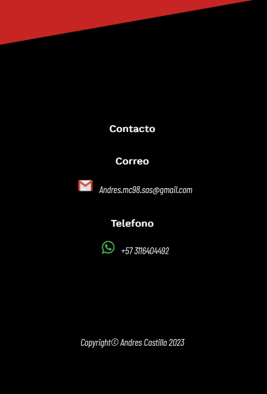

# Marvel-Site
Web Responsive.

**[Marvel-site](https://l-devjs.github.io/Marvel-Site/)**

### Uso Local
- Clonar Repositorio
- Modificar la configuracion de **Vite**
- Ejecutar **npm install** para generar los modulos de node
- Ejecutar en el devServer con **npm run dev**
